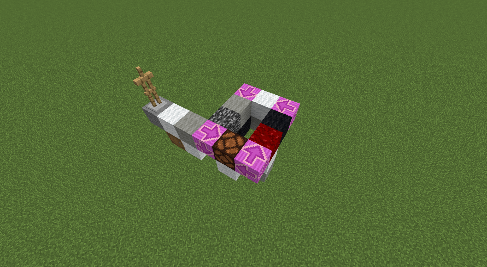
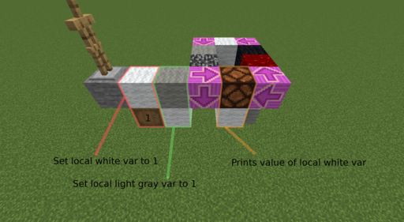
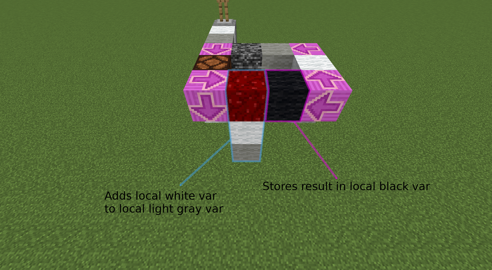
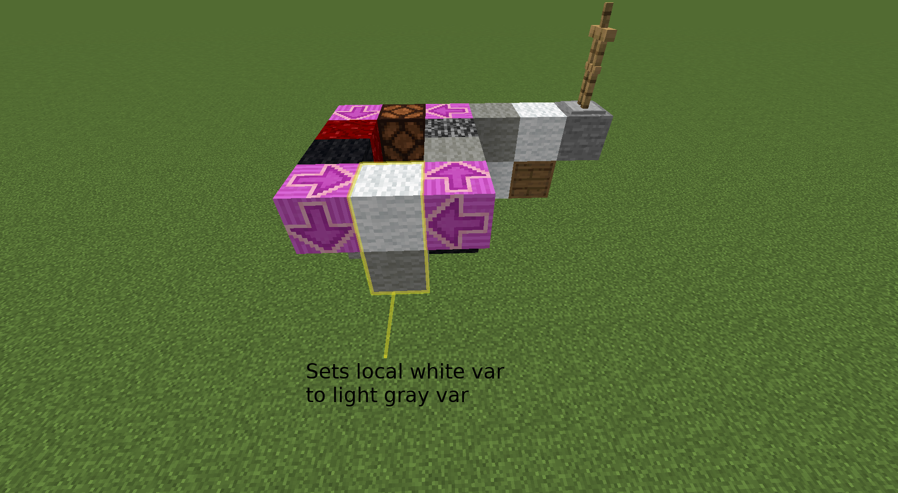
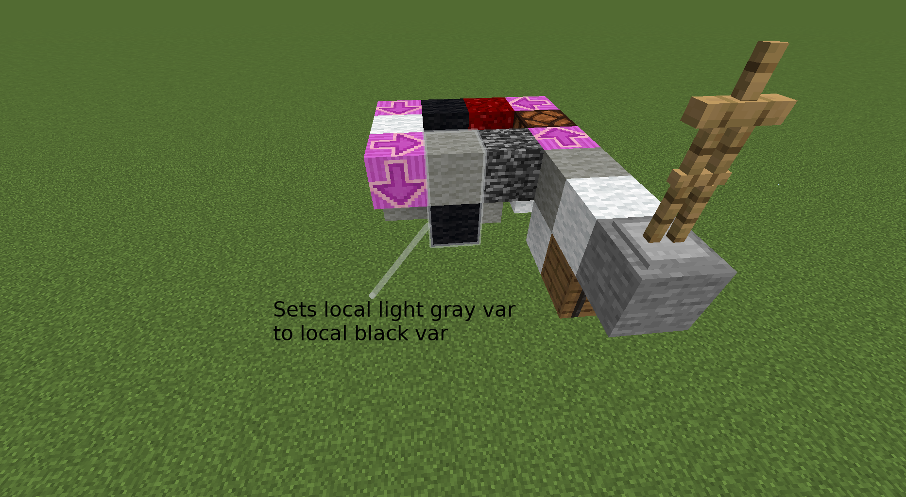

# Minescript (MS)
-----------------

# How to read this file
* numbers (1, 2, 3...) -> indicate the layer of the block i.e 1 is the ground layer, 2 is the second block under, 3 the third etc.
* letters (a, b, c...) -> indicate multiple possibilities for the same layer.
* *TODO* -> to do
* *WIP* -> work in progress
* *internal variable* -> interpreter's score in scoreboard <ins>MSgvars</ins>

# Boolean values

| MS value | Boolean value |
|:--------:|:-------------:|
| 0        | false         |
| 1        | true          |

# End of program
Ends program, destroys interpreter

    1: obsidian


# Null operation
Resets opcount

    1: bedrock


# Values
Value to be assigned to a variable or used in an operation

    2a: barrel with certain number of item (in 1st slot) -> direct assignation
    2b: coloured wool/concrete -> value from other variable
    2c: air -> internal value
    2d: chiseled stone bricks -> value from internal accumulator


# Variable assignation
Assigns the value to the given variable

    1a: coloured wool -> local variable
    1b: coloured concrete -> global variable
    2: value (see #Values)


# Print
Prints the value in the chat

    1: redstone lamp
    a:
        2: value (see #Values)
    b:
        2: hay block
        renamed chicken on top -> prints the name of the chicken


# Arithmetic Operators

## Addition
Adds value B to value A, stores result in internal variable

    1: nether wart block
    2: Value A (see #Values)
    3: Value B (see #Values)

## Subtraction
Subtracts value B from value A, stores result in internal variable

    1: warped wart block
    2: Value A (see #Values)
    3: Value B (see #Values)

## Multiplication
Multiplies value B with value A, stores result in internal variable

    1: slime block
    2: Value A (see #Values)
    3: Value B (see #Values)
## Division
Divides value A by value B, stores result in internal variable

    1: honey block
    2: Value A (see #Values)
    3: Value B (see #Values)

## Modulo
Computes the modulo of value A by value B, stores result in internal variable

    1: honeycomb block
    2: Value A (see #Values)
    3: Value B (see #Values)


# Threading
Creates a new interpreter on the left of the block (relative to the direction of the first interpreter), if condition is true

    1: bookshelf
    2a: air -> evaluates to true
    2b: condition (see #Values)


# Comparison Operators
Compares value A with value B, stores result in internal variable

    1a: carved pumpkin -> !=
    1b: packed ice -> <
    1c: blue ice -> >
    2: Value A (see #Values)
    3: Value B (see #Values)


# Logical Operators

## Not
Stores `NOT value` in internal variable (boolean value)

    1: sea lantern
    2: value (see #Values)

## Or
Stores `A OR B` in internal variable (boolean value)

    1: piston
    2: Value A (see #Values)
    3: Value B (see #Values)

## And
Stores `A AND B` in internal variable (boolean value)

    1: sticky piston
    2: Value A (see #Values)
    3: Value B (see #Values)


# Branch
Changes the direction of the interpreter to the arrow if condition is true

    1: magenta glazed terracota
    2a: air -> evaluates to true
    2b: condition (see #Values)


# Function

## Definition
Creates a function on the left of the block (relative to the direction of the interpreter)

    1: stained glass
    2: redstone block

## Usage
Creates a new interpreter at the corresponding function (if defined)

    1: stained glass

## Delete
Deletes the corresponding function (if defined)

    1: stained glass
    2: magma block


# Pause
Holds the interpreter on the block as long as condition is true

    1: target
    2: condition (see #Values)

# Use module
Calls a function in a module

    1: jukebox
    2: barrel -> should contain certain items which define the module and function id
    3,4,5...: values (depends on the function)

---
# Modules
Modules offer endless possibilities to create your own functionnalities. Here's how you can create your own module and use it in a Minescript program.

Modules are located in the modules folder. To load a module, add you load function in the load_modules function tag, and your main function in the modules function tag. The load function is called once after a reload, and the main function is called whenever a module is called.
For example, for the module math to work, you have to indicate what is the load function and what is the main function.

```
datapacks
|
+-minescript
  |
  +-data
    |
    +-minescript
      |
      +-tags
        |
        +-functions
          |
          +-modules.json -> you can find "minescript:modules/math/interpret"
          |
          +-load_modules.json -> you can find "minescript:modules/math/load"
```

You can do whatever you want in the load function.

For the main/interpret function, you should check if the barrel contains the correct module id, and trigger the correct function according to the function id (see #Use module and paragraphs below). To do so, you can use something like that

`execute if data block ~ ~-2 ~ {Items:[{Slot:0b,id:"minecraft:black_wool",Count:1b}]} run function minescript:modules/math/operation`

This command checks if the first slot of the barrel contains one black wool (id of the math module) and if so runs the function `minescript:modules/math/operation`

Then in that function, the module checks for the different available functions, like sqrt.

`execute if data block ~ ~-2 ~ {Items:[{Slot:9b,id:"minecraft:white_wool",Count:1b}]} run function minescript:modules/math/sqrt`

This command checks if the ninth slot of the barrel (first of the second line) contains one white wool (id of the sqrt function) and if so runs the function `minescript:modules/math/sqrt`

---
# Scoreboards
* **MSgconst**: used for constants
* **MSgvars**: holds global vars and internal variables for each interpreter
* **MSvar_<i>color</i>**: holds local variables of every interpreter
* **MSacc**: accumulator scoreboard
* **MSrot**: holds the rotation of each interpreter
* **MSopcount**: holds the opcount of each interpreter (number of operations executed since last null operation)

---
# Examples

## Fibonacci sequence





